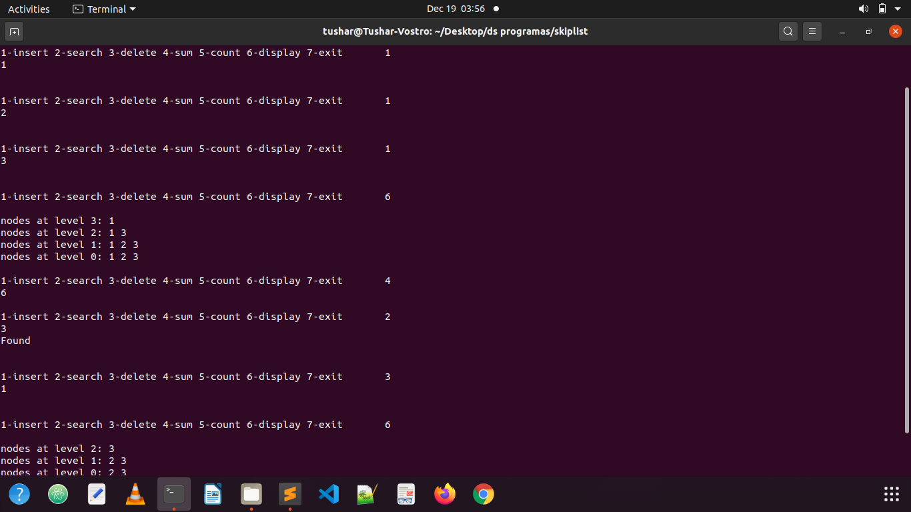

# DSAMiniproject
DSA Mini Project Group 33
## Contributors
   Palash Pratim Deka 	(1912097)<br>
			Nihar Jyoti Basisth	(1912099)<br>
			Anshul Mangal	(1912105)<br>
		 Shikhar Katiyar	(1912109)<br>
			Tushar Sachan	(1912113)<br>
			Krishna Kumar	(1912139) <br>
# Skip List
 <a href="https://www.canva.com/design/DAEQWYM75I0/vqMQhQaE4EA04Ze90LIteQ/view">PRESENTATION OF SKIP LIST</a>

## About Skip List

A skip list is a probabilistic data structure. The skip list is used to store a sorted list of elements or data with a linked list. It allows the process of the elements or data to view efficiently. In one single step, it skips several elements of the entire list, which is why it is known as a skip list.

The average insert/update/delete performance of a skip list is O(log(n)).However, skip lists depend on probability to accomplish this result, so it's not guaranteed. In the worst case, which is very uncommon, an operation may be linear in the number of list elements. Because skip list performance is non-deterministic, they are less commonly seen in the wild than other associative data structures.

# How can I Use It?

However you like, basic operatons using a linked list are shown below,

Inserting an element in the List It is used to add a new node to a particular location in a specific situation. For insertion we first search for the element and if it doesn't exist in the list yet proceed with the following steps: Flip a coin to determine in how many levels the new element has to be inserted into, from the position we found (which is necessarily on the lowest level) create nodes containing the new element pointing to itself in the level below and the next bigger element to the right while changing the previous node's pointer to the new element. If the number of positive coin flips is bigger than the current number of levels we have to introduce new minus infinity nodes and let all except the most upper one point a the new element which of course also has to point down. In the end we just have to adjust the hight variable h.

Deleting an element from the list It is used to delete a node in a specific situation. To remove an element again first search for it and then remove all nodes containing the element while adjusting the pointers. If necessary delete upper levels which became empty.

Searching an element in a given list The search operation is used to search a particular node in a skip list. If we now search for a certain element we don't have to touch every element but starting from the upper levels we follow the right pointers and skip (hence the name) all elements which only exist in lower lists, until we find an element which is bigger than the one we search for. Then we have to go down a level to refine the search, repeat the steps until we either find the element or reach the lowest list and find out that the element is not in the list.



## How to implement the Header File in a program

To make a header file, we have to create one file with a name, and extension should be "".h"". In that function there will be no ``` main()``` function. In that file, we can put some variables, some functions etc. To use that header file, it should be present at the same directory, where the program is located. Now using  ```#include``` we have to put the header file name. The name will be inside double quotes. Include syntax will be look like this.

To include the header file in your program use

           #include"header_file.h"
	   
	  
So the snippet:
`#include<stdio.h>
#include<stdlib.h>
#include "SkipList.h"
int MAXLEVEL;

int main(){
	struct SkipList list;
	init_Skiplist(&list,5);
	while(1)
	{`

